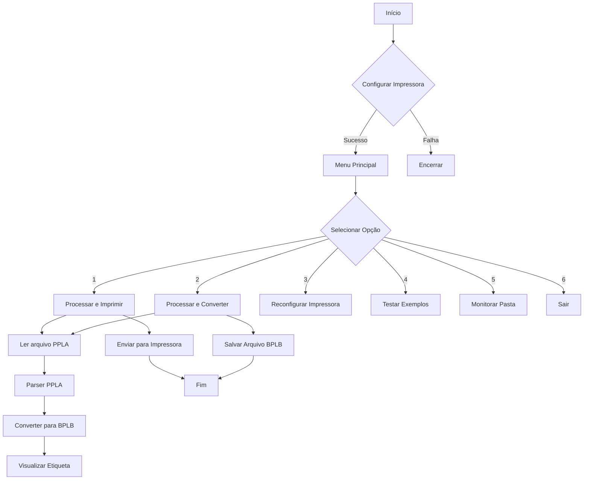
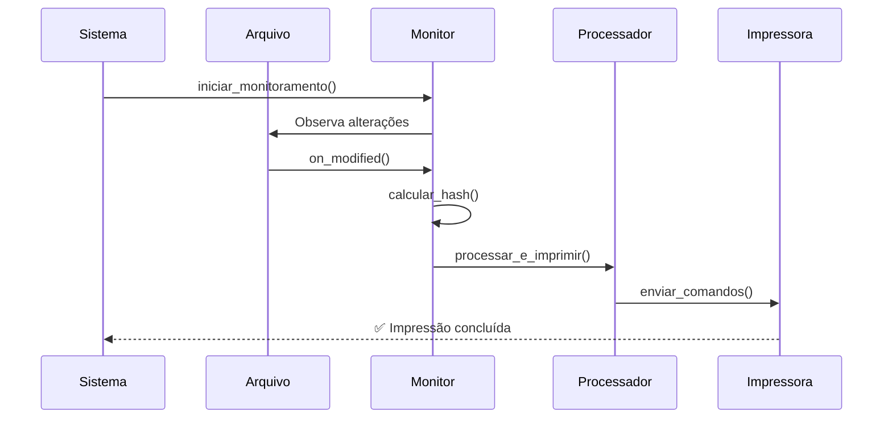

# 🏷️ Conversor PPLA para BPLB - Documentação Completa


## 📋 Índice
1. [Visão Geral](#visão-geral)
2. [Arquitetura do Sistema](#arquitetura-do-sistema)
3. [Diagrama de Fluxo](#diagrama-de-fluxo)
4. [Classes e Funcionalidades](#classes-e-funcionalidades)
5. [Configuração](#configuração)
6. [Formato de Arquivos](#formato-de-arquivos)
7. [Uso do Sistema](#uso-do-sistema)
8. [Monitoramento Automático](#monitoramento-automático)
9. [Tratamento de Erros](#tratamento-de-erros)
10. [Exemplos](#exemplos)

---

## 🎯 Visão Geral

O **Conversor PPLA para BPLB** é um sistema completo que converte arquivos de etiquetas do formato PPLA (usado por impressoras Zebra) para o formato BPLB (compatível com impressoras Elgin BPT-L42), com capacidade de impressão direta e monitoramento automático de arquivos.

### Características Principais
- ✅ **Conversão inteligente** de PPLA para BPLB
- 🖨️ **Suporte a impressão direta** via pywin32
- 🔍 **Monitoramento automático** de pasta
- 🧠 **Parser inteligente** que identifica campos automaticamente
- 📊 **Visualização em terminal** das etiquetas
- ⚙️ **Configuração interativa** de impressora
- 💾 **Backup automático** dos arquivos BPLB gerados

---

## 🏗️ Arquitetura do Sistema

### Diagrama de Alto Nível
```
┌─────────────────────────────────────────────────────────────┐
│                      APLICAÇÃO PRINCIPAL                    │
├─────────────────────────────────────────────────────────────┤
│  ┌──────────┐  ┌──────────┐  ┌──────────┐  ┌──────────┐   │
│  │   Menu   │  │ Config   │  │Monitor   │  │  Testes  │   │
│  │ Principal│  │Impressora│  │Arquivos  │  │          │   │
│  └──────────┘  └──────────┘  └──────────┘  └──────────┘   │
└─────────────────────────────────────────────────────────────┘
                              │
┌─────────────────────────────────────────────────────────────┐
│                    NÚCLEO DE CONVERSÃO                      │
├─────────────────────────────────────────────────────────────┤
│  ┌────────────┐      ┌──────────────┐      ┌────────────┐  │
│  │ PPLAParser │─────▶│ PPLAtoBPLB   │─────▶│BPLBGenerator│ │
│  │            │      │ Converter    │      │            │  │
│  └────────────┘      └──────────────┘      └────────────┘  │
└─────────────────────────────────────────────────────────────┘
                              │
┌─────────────────────────────────────────────────────────────┐
│                    CAMADA DE IMPRESSÃO                      │
├─────────────────────────────────────────────────────────────┤
│                   ┌──────────────────┐                     │
│                   │ ImpressoraBPLB   │                     │
│                   │                  │                     │
│                   └──────────────────┘                     │
└─────────────────────────────────────────────────────────────┘
```

---

## 📊 Diagrama de Fluxo



---

## 🧩 Classes e Funcionalidades

### 1. **BPLBGenerator** 🏗️
**Responsabilidade**: Gerar comandos no formato BPLB

| Método | Descrição | Parâmetros |
|--------|-----------|------------|
| `remover_acentos()` | Remove acentos e caracteres especiais | `texto: str` |
| `iniciar_etiqueta()` | Inicia nova etiqueta com configurações padrão | - |
| `adicionar_texto()` | Adiciona texto à etiqueta | `x, y, texto, fonte, tamanho_h, tamanho_v` |
| `adicionar_codigo_barras()` | Adiciona código de barras | `x, y, codigo, tipo, largura_fina, altura` |
| `adicionar_borda()` | Adiciona borda retangular | `x1, y1, x2, y2, espessura` |
| `finalizar_etiqueta()` | Finaliza etiqueta com quantidade | `quantidade: int` |

### 2. **PPLAParser** 🔍
**Responsabilidade**: Analisar e extrair dados de arquivos PPLA

| Método | Descrição |
|--------|-----------|
| `parse_file()` | Analisa arquivo PPLA e extrai etiquetas |
| `_processar_etiqueta()` | Processa uma etiqueta individual |
| `_processar_textos_inteligente()` | Processa textos com lógica inteligente |

### 3. **PPLAtoBPLBConverter** ⚙️
**Responsabilidade**: Coordenar a conversão de PPLA para BPLB

**Fluxo de Conversão**:
1. Recebe dados do PPLAParser
2. Usa BPLBGenerator para criar etiqueta
3. Posiciona elementos automaticamente
4. Aplica formatação adequada

### 4. **ImpressoraBPLB** 🖨️
**Responsabilidade**: Gerenciar comunicação com impressora

| Método | Descrição |
|--------|-----------|
| `listar_impressoras()` | Lista impressoras disponíveis no sistema |
| `enviar_comandos()` | Envia comandos BPLB para impressora |

### 5. **ArquivoAlteradoHandler** 👁️
**Responsabilidade**: Monitorar alterações em arquivos

- Herda de `FileSystemEventHandler`
- Detecta modificações no arquivo `Imprime.txt`
- Evita processamento duplicado com hash MD5
- Processa automaticamente quando arquivo é salvo

---

## ⚙️ Configuração

### Requisitos do Sistema
```bash
pip install pywin32 watchdog
```

### Configuração da Impressora
O sistema guia o usuário através de:
1. Verificação de dependências
2. Listagem de impressoras disponíveis
3. Identificação automática de BPT-L42
4. Seleção interativa
5. Configuração da impressora padrão

### Estrutura de Pastas
```
C:\Imp\                    # Pasta monitorada
├── Imprime.txt           # Arquivo fonte PPLA
└── bplb_output\          # Gerado automaticamente
    ├── arquivo_etq1.bplb
    └── arquivo_etq2.bplb
```

---

## 📄 Formato de Arquivos

### Formato PPLA (Entrada)
```xml
<xpml><page quantity='1' pitch='75.1 mm'></xpml>
1911A1202510200CONSERTO
1911A1202510044OP:
1911A1202250044Ref:
1911A1202250089121302105
1911A140248008921301507
...
Q0001
E
<xpml></page></xpml><xpml><end/></xpml>
```

### Formato BPLB (Saída)
```bplb
N
D7
S3
JF
Q550
q800
LE20,20,760,2
LE20,550,760,2
...
A100,50,0,3,3,3,N,"CONSERTO"
B150,300,0,1,3,5,80,B,"12345678"
P1
```

### Campos Extraídos
| Campo | Descrição | Exemplo |
|-------|-----------|---------|
| `tipo` | Tipo de etiqueta | "CONSERTO" |
| `op` | Número da OP | "123456" |
| `referencia` | Referência do produto | "987654" |
| `descricao` | Descrição do produto | "CAMISETA MASC" |
| `faccao` | Facção/Fornecedor | "LP ACABAMENTOS" |
| `cidade` | Cidade | "GUABIRUBA" |
| `regiao` | Região | "SC - MEIO VALE" |
| `fracao` | Fração (ex: "2/2") | "1/1" |
| `codigo_barras` | Código de barras | "2130150727412" |

---

## 🚀 Uso do Sistema

### Modo Interativo
```bash
python conversor_ppla_bplb.py
```

### Opções do Menu
```
1. Processar arquivo e imprimir
2. Processar arquivo (apenas converter)
3. Reconfigurar impressora
4. Testar exemplo com etiqueta CONSERTO
5. Iniciar monitoramento automático
6. Sair
```

### Exemplo de Uso Direto
```python
# Configuração manual
configurar_impressora()

# Processamento direto
processar_e_imprimir("caminho/arquivo.ppla", imprimir=True)
```

---

## 👁️ Monitoramento Automático

### Funcionamento
1. Monitora a pasta `C:\Imp`
2. Observa alterações no arquivo `Imprime.txt`
3. Calcula hash MD5 para evitar reprocessamento
4. Processa automaticamente quando detecta mudanças
5. Imprime etiquetas convertidas

### Configuração do Monitoramento
```python
iniciar_monitoramento()
```
**Saída**:
```
🔍 Monitorando alterações no arquivo...
📁 Pasta: C:\Imp
📄 Arquivo: Imprime.txt
🖨️  Impressora: BPT-L42
⏳ Aguardando alterações...
```

### Fluxo do Monitoramento


---

## ⚠️ Tratamento de Erros

### Erros Comuns e Soluções
| Erro | Causa | Solução |
|------|-------|---------|
| `pywin32 não instalado` | Dependência faltando | `pip install pywin32` |
| `Nenhuma impressora encontrada` | Driver não instalado | Instalar driver BPT-L42 |
| `Falha ao processar arquivo` | Formato PPLA inválido | Verificar arquivo fonte |
| `Erro de conexão com impressora` | Impressora offline | Verificar conexão USB |
| `Arquivo não encontrado` | Caminho incorreto | Verificar caminho absoluto |

### Logs do Sistema
- ✅ Sucesso: Verde com emoji ✅
- ⚠️ Avisos: Amarelo com emoji ⚠️
- ❌ Erros: Vermelho com emoji ❌
- 🔍 Debug: Informações detalhadas

---

## 📝 Exemplos

### Exemplo 1: Etiqueta COM CONSERTO
**Entrada PPLA**:
```xml
1911A1202510200CONSERTO
1911A1202510044OP:
1911A1202250044Ref:
1911A1202250089121302105
```

**Saída BPLB** (visualização):
```
┌────────────────────────────────────┐
│           CONSERTO                 │
│                                    │
│ OP: 123456      REF: 987654321    │
│                                    │
│      CAMISETA CASUAL MASC          │
│                                    │
│ FACCÃO: LP ACABAMENTOS             │
│ CIDADE: GUABIRUBA  REGIAO: SC     │
│                                    │
│          ████████████████          │
│          2130150727412             │
└────────────────────────────────────┘
```

### Exemplo 2: Etiqueta SEM CONSERTO
**Entrada PPLA**:
```xml
1911A1202510044OP:
1911A1202250044Ref:
1911A1202250089121301027
1911A140248008921303219
```

**Saída BPLB** (visualização):
```
┌────────────────────────────────────┐
│                                    │
│ OP: 987654      REF: 123456789    │
│                                    │
│      CAMISA CASUAL MASC ML         │
│                                    │
│ FACCÃO: MARCELO LONDRINA           │
│ CIDADE: LONDRINA                   │
│                                    │
│          ████████████████          │
│          2130321901                │
└────────────────────────────────────┘
```

---

## 🔧 Personalização

### Parâmetros Ajustáveis
```python
# Em BPLBGenerator.__init__()
self.largura_etiqueta = 800    # Largura em pontos
self.altura_etiqueta = 550     # Altura em pontos

# Em PPLAtoBPLBConverter.converter_etiqueta()
largura_fina = 3               # Largura barra fina código de barras
largura_larga = 5              # Largura barra larga
altura_barras = 80             # Altura código de barras
```

### Adicionar Novos Campos
1. Modificar `PPLAParser._processar_textos_inteligente()`
2. Adicionar lógica para novo campo
3. Atualizar `PPLAtoBPLBConverter.converter_etiqueta()`
4. Adicionar posicionamento na etiqueta BPLB

---

## 📈 Melhorias Futuras

### Planejadas
1. **Suporte a mais formatos** de etiqueta
2. **Interface gráfica** com Tkinter/PyQt
3. **Banco de dados** para histórico de impressões
4. **API REST** para integração web
5. **Suporte a mais impressoras** além da BPT-L42
6. **Template system** para layouts customizados
7. **Preview gráfico** das etiquetas
8. **Exportação para PDF/PNG**

### Otimizações
1. **Multithreading** para processamento paralelo
2. **Cache** de templates convertidos
3. **Compressão** de arquivos BPLB
4. **Logging estruturado** para análise

---

## 🤝 Contribuição

### Estrutura do Projeto
```
conversor-ppla-bplb/
├── src/
│   ├── core/           # Núcleo do conversor
│   ├── printers/       # Drivers de impressora
│   ├── parsers/        # Parsers de formato
│   └── utils/          # Utilitários
├── tests/              # Testes unitários
├── docs/               # Documentação
└── examples/           # Exemplos de uso
```

### Padrões de Código
- **PEP 8** para estilo de código
- **Docstrings** em inglês ou português
- **Type hints** para tipagem estática
- **Logging consistente** com emojis

---

## 📄 Licença

Este projeto está licenciado sob a MIT License - veja o arquivo LICENSE para detalhes.

## 🙏 Agradecimentos

- **Elgin** pela documentação da BPT-L42
- **Zebra** pelo formato PPLA
- **Python Software Foundation**
- **Comunidade open source**

---

*Documentação gerada automaticamente pelo sistema - Versão 1.0.0*  
*Última atualização: {datetime.now().strftime('%d/%m/%Y %H:%M:%S')}*